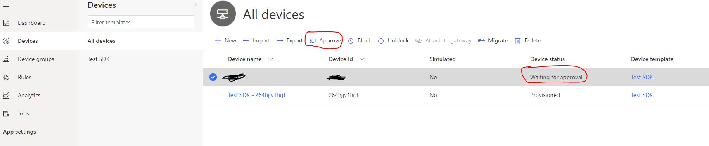

# Azure IoTCentral SDK for MicroPython

[](https://gitter.im/iotdisc/community?utm_source=badge&utm_medium=badge&utm_campaign=pr-badge&utm_content=badge)
[](https://github.com/iot-for-all/iotc-micropython-client/blob/master/LICENSE)
[](https://badge.fury.io/py/micropython-iotc)

### An Azure IoT Central device client library for Micropython.
This repository contains code for the Azure IoT Central SDK for Micropython. This enables micropython developers to easily create device solutions that semealessly connect to Azure IoT Central applications.
It can run on various boards with some tweaks for low-memory devices.


## Prerequisites
+ Micropython 1.12+ (recommended)

## Import ``iotc``
In most of the micropython capable boards, is sufficient to import library or install it if missing through upip.

```py
try:
    import iotc
except:
    import upip
    upip.install('micropython-iotc')
    import iotc
```

The same commands apply when running through Micropython REPL.

> **NOTE:** for low-end devices like the **ESP8266**, importing as external module can cause out-of-memory exception during execution because of the limited amount of heap space.
For this kind of boards, putting the library on flash memory as a frozen module might be the only available option.<br/><br/>
Details on how to build a custom firmware for specific boards with frozen modules can be found on official micropython [github repository](https://github.com/micropython/micropython) and [website](http://docs.micropython.org/en/latest/).


## Samples
Check out the [sample repository](samples) for example code showing how the SDK can be used in the various scenarios:


## Connecting
Currently only connection through Shared Access Keys is supported.
You can use both device keys or group keys.

### Init
```py
from iotc import IoTCConnectType
id_scope = 'scopeID'
device_id = 'device_id'
sasKey = 'masterKey' # or use device key directly
conn_type=IoTCConnectType.SYMM_KEY # or use DEVICE_KEY if working with device keys
client = IoTCClient(id_scope, device_id, conn_type, sasKey)
```

You can pass a logger instance to have your custom log implementation. (see [#Logging](#logging))

e.g.

```py
from iotc import ConsoleLogger,IoTCLogLevel
logger = ConsoleLogger(IoTCLogLevel.ALL)
client = IoTCClient(id_scope, device_id, conn_type, sasKey, logger)
```

### Connect

```py
client.connect()
```
After successfull connection, IOTC context is available for further commands.

## Operations

### Send telemetry

```py
client.send_telemetry(payload,properties=None)
```

e.g. Send telemetry every 3 seconds
```py
while client.is_connected():
    print('Sending telemetry')
    client.send_telemetry({'temperature':randint(0,20),'pressure':randint(0,20),'acceleration':{'x':randint(0,20),'y':randint(0,20)}})
    sleep(3)
```
An optional *properties* object can be included in the send methods, to specify additional properties for the message (e.g. timestamp,etc... ).
Properties can be custom or part of the reserved ones (see list [here](https://github.com/Azure/azure-iot-sdk-csharp/blob/master/iothub/device/src/MessageSystemPropertyNames.cs#L36)).

> **NOTE:** Payload content type and encoding are set by default to 'application/json' and 'utf-8'. Alternative values can be set using these functions:<br/>
_iotc.set_content_type(content_type)_ # .e.g 'text/plain'
_iotc.set_content_encoding(content_encoding)_ # .e.g 'ascii'

### Send property update
```py
client.send_property({'fieldName':'fieldValue'})
```

## Listen to events
Due to limitations of the Mqtt library for micropython, you must explictely declare your will to listen for incoming messages. This client implements a non-blocking way of receiving messages so if no messages are present, it will not wait for them and continue execution.

To make sure your client receives all messages just call _listen()_ function in your main loop. Be aware that some sleeping time (200 ms +) is needed in order to let the underlying library listen for messages and release the socket.

```py
while client.is_connected():
    client.listen() # listen for incoming messages
    client.send_telemetry(...)
    sleep(3)
```
You also need to subscribe to specific events to effectively process messages, otherwise client would just skip them (see below).

### Listen to properties update
Subscribe to properties update event before calling _connect()_:
```py
client.on(IoTCEvents.PROPERTIES, callback)
```
To provide property sync aknowledgement, the callback must return the 
property value if has been successfully applied or nothing.

e.g.
```py
def on_props(prop_name, prop_value):
    if prop_value>10:
        # process property
        return prop_value

client.on(IoTCEvents.PROPERTIES, on_props)
```

### Listen to commands
Subscribe to command events before calling _connect()_:
```py
client.on(IoTCEvents.COMMANDS, callback)
```
To provide feedbacks for the command like execution result or progress, the client can call the **ack** function available in the callback.

The function accepts 2 arguments: the command instance and a custom response message.
```py
def on_commands(command, ack):
    print(command.name)
    ack(command, 'Command received')

client.on(IoTCEvents.COMMANDS, on_commands)
```

## Logging

The default log prints to serial console operations status and errors.
This is the _API_ONLY_ logging level.
The function __set_log_level()__ can be used to change options or disable logs. It accepts a _IoTCLogLevel_ value among the following:

-  IoTCLogLevel.DISABLED (log disabled)
-  IoTCLogLevel.API_ONLY (information and errors, default)
-  IoTCLogLevel.ALL (all messages, debug and underlying errors)

The device client also accepts an optional Logger instance to redirect logs to other targets than console.
The custom class must implement three methods:

- info(message)
- debug(message)
- set_log_level(message);

## One-touch device provisioning and approval
A device can send custom data during provision process: if a device is aware of its IoT Central template Id, then it can be automatically provisioned.

### How to set IoTC template ID in your device
Template Id can be found in the device explorer page of IoTCentral


Then call this method before connect():

```py
client.set_model_id('<modelId>');
```

### Manual approval (default)
By default device auto-approval in IoT Central is disabled, which means that administrator needs to approve the device registration to complete the provisioning process.
This can be done from explorer page after selecting the device



### Automatic approval
To change default behavior, administrator can enable device auto-approval from Device Connection page under the Administration section.
With automatic approval a device can be provisioned without any manual action and can start sending/receiving data after status changes to "Provisioned"


## License
This samples is licensed with the MIT license. For more information, see [LICENSE](./LICENSE)